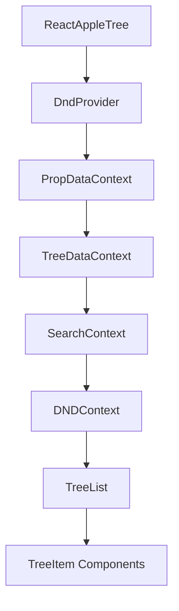

## Architecture

React Apple Tree is built with a clean separation of concerns, featuring two main component exports that handle different use cases.

## Component Variants

### ReactAppleTree

The default export that includes a React DnD context provider.

```tsx src/ReactAppleTree.tsx
import React from 'react';
import { DndProvider } from 'react-dnd';
import { HTML5Backend } from 'react-dnd-html5-backend';
import ReactAppleTreeWithoutDndContext from './ReactAppleTreeWithoutDndContext';
import { ReactAppleTreeProps } from './types';

export default function ReactAppleTree<T>(
  props: React.PropsWithChildren<ReactAppleTreeProps<T>>,
) {
  return (
    <DndProvider backend={HTML5Backend}>
      <ReactAppleTreeWithoutDndContext {...props} />
    </DndProvider>
  );
}
```

<Info>
**When to use:** This is the recommended variant for most use cases. Use this when you don't have an existing React DnD context in your application.
</Info>

### ReactAppleTreeWithoutDndContext

A variant without the DnD context wrapper for advanced use cases.

```tsx src/ReactAppleTreeWithoutDndContext.tsx
export default function ReactAppleTreeWithoutDndContext<T>(
  props: React.PropsWithChildren<ReactAppleTreeProps<T>>,
) {
  return (
    <PropDataContextProvider>
      <TreeDataContextProvider>
        <SearchContextProvider>
          <DNDContextProvider>
            <StyledReactAppleTree className={props.className}>
              <TreeList {...props} />
            </StyledReactAppleTree>
          </DNDContextProvider>
        </SearchContextProvider>
      </TreeDataContextProvider>
    </PropDataContextProvider>
  );
}
```

<Warning>
**When to use:** Only use this variant if you already have a `DndProvider` in your application hierarchy. This prevents nested DnD contexts which can cause conflicts.
</Warning>

## Context Hierarchy

The component uses a layered context architecture for state management:

### PropDataContext

Stores and provides access to all props passed to the component. This allows child components to access configuration without prop drilling.

### TreeDataContext

Manages the internal tree state:
- **treeMap**: A flattened map of all nodes indexed by their keys
- **flatTree**: A flat array representation of visible nodes for rendering
- **setTreeMap/setFlatTree**: Functions to update the tree state

### SearchContext

Handles search functionality:
- Search query state
- Search results and matching nodes
- Focus management for search results

### DNDContext

Manages drag-and-drop operations:
- Dragging node information
- Drop zone calculations
- Drop validation logic

## Data Flow



## Component Hierarchy

<Steps>
  <Step title="Root Component">
    `ReactAppleTree` or `ReactAppleTreeWithoutDndContext` receives props and initializes contexts
  </Step>
  
  <Step title="TreeList">
    Renders the virtualized list of tree items. Manages the list layout and passes data to individual items.
  </Step>
  
  <Step title="TreeItem">
    Individual tree nodes with drag handles, drop targets, and expand/collapse controls. Each item has access to:
    - Node data and metadata
    - Drag and drop hooks
    - Expansion state
    - Custom renderers
  </Step>
</Steps>

## Props Flow

All props passed to `ReactAppleTree` are stored in `PropDataContext` and accessed by child components:

```tsx
interface ReactAppleTreeProps<T> {
  // Required
  treeData: Array<TreeItem<T>>;          // The tree structure
  onChange: (treeData: Array<TreeItem<T>>) => void;  // Update handler
  getNodeKey: GetNodeKeyFn<T>;           // Node key extractor
  
  // Optional callbacks
  generateNodeProps?: GenerateNodePropsFn<T>;
  onMoveNode?: OnMoveNodeFn<T>;
  onVisibilityToggle?: OnVisibilityToggleFn<T>;
  onDragStateChanged?: OnDragStateChangedFn<T>;
  
  // Drag and drop configuration
  canDrag?: CanDragFn;
  canDrop?: CanDropFn<T>;
  dndType?: string;
  shouldCopyOnOutsideDrop?: boolean | ((data) => boolean);
  
  // Tree configuration
  maxDepth?: number;
  canNodeHaveChildren?: boolean | ((node) => boolean);
  
  // Styling and rendering
  scaffoldBlockPxWidth?: number;
  rowHeight?: number;
  nodeContentRenderer?: NodeRenderer<T>;
  placeholderRenderer?: PlaceholderRenderer<T>;
  
  // Search
  searchQuery?: string;
  searchMethod?: SearchMethodFn<T>;
  searchFocusOffset?: number;
  
  // Performance
  isVirtualized?: boolean;
}
```

## State Management

### Internal State

The component maintains two key internal representations:

1. **TreeMap**: Object mapping node keys to node data for O(1) lookups
2. **FlatTree**: Array of visible nodes in render order

### State Updates

When tree data changes:

<Steps>
  <Step title="Flatten">
    Tree data is flattened into `treeMap` and `flatTree` representations
  </Step>
  
  <Step title="Render">
    `flatTree` is used for efficient rendering, only showing expanded nodes
  </Step>
  
  <Step title="Update">
    On user interactions, internal state is updated and `onChange` is called with the new tree
  </Step>
</Steps>

## Performance Optimizations

<CardGroup cols={2}>
  <Card title="Virtualization" icon="rocket">
    By default, the tree uses virtualization (react-window) to only render visible nodes, enabling smooth performance with thousands of items.
  </Card>
  
  <Card title="Flat Structure" icon="layer-group">
    Maintains a flattened representation of visible nodes for O(1) access during rendering and drag operations.
  </Card>
  
  <Card title="Context Separation" icon="diagram-project">
    Separates concerns into focused contexts to minimize unnecessary re-renders.
  </Card>
  
  <Card title="Lazy Updates" icon="bolt">
    Only expands/collapses nodes on demand, avoiding computation for hidden subtrees.
  </Card>
</CardGroup>

## Usage Examples

### Basic Usage (Recommended)

```tsx
import ReactAppleTree from 'react-apple-tree';
import 'react-apple-tree/dist/index.css';

function MyTree() {
  const [treeData, setTreeData] = useState([
    {
      id: '1',
      title: 'Parent Node',
      expanded: true,
      children: [
        { id: '1-1', title: 'Child Node' }
      ]
    }
  ]);
  
  return (
    <ReactAppleTree
      treeData={treeData}
      onChange={setTreeData}
      getNodeKey={({ node }) => node.id}
    />
  );
}
```

### With Existing DnD Context

```tsx
import { DndProvider } from 'react-dnd';
import { HTML5Backend } from 'react-dnd-html5-backend';
import { ReactAppleTreeWithoutDndContext } from 'react-apple-tree';

function App() {
  return (
    <DndProvider backend={HTML5Backend}>
      {/* Other components using DnD */}
      <MyTree />
    </DndProvider>
  );
}

function MyTree() {
  return (
    <ReactAppleTreeWithoutDndContext
      treeData={treeData}
      onChange={setTreeData}
      getNodeKey={({ node }) => node.id}
    />
  );
}
```

## Next Steps

<CardGroup cols={2}>
  <Card title="Tree Data Structure" icon="sitemap" href="/concepts/tree-data-structure">
    Learn about the TreeItem interface and how to structure your data
  </Card>
  
  <Card title="Tree Operations" icon="code" href="/concepts/tree-operations">
    Explore utility functions for manipulating tree data
  </Card>
  
  <Card title="Drag and Drop" icon="hand" href="/concepts/drag-and-drop">
    Understand how drag-and-drop functionality works
  </Card>
  
  <Card title="API Reference" icon="book" href="/api-reference">
    View complete API documentation
  </Card>
</CardGroup>